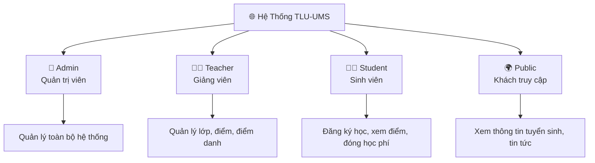

# 🏛️ Tổng Quan Dự Án — ThangLong University Web

> **Mã tài liệu:** DOC-00  
> **Phiên bản:** 1.0  
> **Ngày tạo:** 28/05/2026  

---

## Mục Lục

- [1. Tên Dự Án](#1-tên-dự-án)
- [2. Mục Tiêu Dự Án](#2-mục-tiêu-dự-án)
- [3. Vấn Đề Cần Giải Quyết](#3-vấn-đề-cần-giải-quyết)
- [4. Đối Tượng Sử Dụng](#4-đối-tượng-sử-dụng)
- [5. Phạm Vi Hệ Thống](#5-phạm-vi-hệ-thống)
- [6. Giá Trị Mang Lại](#6-giá-trị-mang-lại)
- [7. Công Nghệ Sử Dụng](#7-công-nghệ-sử-dụng)
- [8. Cấu Trúc Tổng Quan Project](#8-cấu-trúc-tổng-quan-project)
- [9. Tóm Tắt Các Module Chính](#9-tóm-tắt-các-module-chính)

---

## 1. Tên Dự Án

| Thông tin | Chi tiết |
|-----------|---------|
| **Tên đầy đủ** | ThangLong University Web — University Management System (UMS) |
| **Tên viết tắt** | TLU-UMS |
| **Repo name** | ThangLongUniversityWeb |
| **Khởi tạo** | 2026 |
| **Trạng thái** | Đang phát triển (In Development) |

---

## 2. Mục Tiêu Dự Án

Xây dựng một **nền tảng web tích hợp** cho trường Đại học Thăng Long, bao gồm:

1. **Cổng thông tin tuyển sinh** (Marketing Website) — dành cho công chúng, thí sinh.
2. **Cổng sinh viên** (Student Portal) — quản lý học tập, đăng ký học phần, kết quả học tập, học phí.
3. **Cổng giảng viên** (Teacher Portal) — quản lý lớp học, điểm danh, nhập điểm.
4. **Cổng quản trị** (Admin Portal) — quản lý toàn bộ hệ thống, người dùng, chương trình đào tạo.

---

## 3. Vấn Đề Cần Giải Quyết

| # | Vấn đề | Giải pháp trong hệ thống |
|---|--------|--------------------------|
| 1 | Quy trình đăng ký học phần thủ công, dễ lỗi, không xử lý được đồng thời | Kafka message queue, xử lý bất đồng bộ |
| 2 | Không có hệ thống theo dõi GPA, CPA tập trung | Module `academic_results`, tính toán tự động |
| 3 | Thanh toán học phí qua nhiều kênh khác nhau | Tích hợp VNPay |
| 4 | Giao tiếp nội bộ phân tán | Chat real-time (WebSocket + Kafka) |
| 5 | Sinh viên khó tra cứu thông tin | Chatbot AI (RAG với Groq + embedding) |
| 6 | Quản lý nhân sự, khóa học phân tán | Admin Panel tập trung |
| 7 | Không có hệ thống điểm danh điện tử | Module điểm danh theo buổi học |

---

## 4. Đối Tượng Sử Dụng



| Tác nhân | Vai trò | Quyền hệ thống |
|----------|---------|---------------|
| **Admin** | Quản trị viên hệ thống | Toàn quyền (`role = ADMIN`) |
| **Teacher** | Giảng viên | Quản lý lớp học phần của mình (`role = TEACHER`) |
| **Student** | Sinh viên | Đăng ký học, xem điểm, đóng tiền (`role = STUDENT`) |
| **Public** | Khách truy cập | Xem website marketing, không cần đăng nhập |

---

## 5. Phạm Vi Hệ Thống

### ✅ Trong phạm vi (In Scope)

- Xác thực & phân quyền (JWT, 3 role)
- Quản lý tài khoản người dùng (Admin, Student, Teacher)
- Quản lý cơ cấu học thuật: Ngành (Major), Khoa (Department), Lớp niên chế (Homeroom)
- Quản lý chương trình đào tạo: Môn học (Course), điều kiện tiên quyết
- Quản lý học kỳ (Semester) và lớp học phần (Class Section)
- Phòng học (Room) và tiết học (Period)
- Đăng ký học phần (Enrollment) — xử lý qua Kafka
- Đăng ký thi lại / học lại (Retake/Improve Registration)
- Điểm danh theo buổi (Attendance)
- Nhập và quản lý điểm (Grade)
- Kết quả học tập GPA/CPA (Academic Results)
- Học phí và thanh toán VNPay (Tuition)
- Chat real-time (Chat Rooms, Messages via WebSocket)
- Chatbot AI hỗ trợ sinh viên (RAG với Groq LLM)
- Quản lý knowledge base cho chatbot (Admin Knowledge)
- Thông báo hệ thống (Notifications)
- Xuất Excel (Export)
- Website marketing (Landing, Admissions, Programs, Articles, About)
- Sitemaps

### ❌ Ngoài phạm vi (Out of Scope)

- Ứng dụng mobile (chỉ web)
- LMS (Learning Management System) đầy đủ — không có module nộp bài, quiz
- Email marketing, CRM tuyển sinh chi tiết
- Quản lý cơ sở vật chất, tài sản
- Hệ thống ERP tổng thể

---

## 6. Giá Trị Mang Lại

| Đối tượng | Giá trị |
|-----------|---------|
| 🎓 **Sinh viên** | Đăng ký học phần dễ dàng, theo dõi GPA/CPA, đóng học phí online, tra cứu lịch thi, chat với giảng viên |
| 👨‍🏫 **Giảng viên** | Quản lý lớp học, nhập điểm, điểm danh điện tử, giao tiếp với sinh viên |
| 👑 **Admin** | Quản lý toàn bộ hệ thống từ một dashboard, xuất báo cáo Excel, kiểm soát học kỳ |
| 🏫 **Nhà trường** | Số hóa quy trình quản lý, giảm tải công việc hành chính, tăng minh bạch |

---

## 7. Công Nghệ Sử Dụng

### 7.1 Backend

| Thành phần | Công nghệ | Phiên bản |
|-----------|-----------|-----------|
| Framework | Spring Boot | 3.x |
| Ngôn ngữ | Java | 17 (LTS) |
| Build tool | Gradle (Kotlin DSL) | — |
| Database | PostgreSQL | 15 |
| ORM | Spring Data JPA (Hibernate) | 6.x |
| Bảo mật | Spring Security + JWT | 6.x |
| Cache | Redis | 7+ |
| Message Queue | Apache Kafka | 3.x |
| Real-time | WebSocket (STOMP) | — |
| API Docs | Springdoc OpenAPI (Swagger) | 2.x |
| AI/LLM | Groq (LLAMA-based) | — |
| Lưu file | Cloudinary | — |
| Thanh toán | VNPay | — |

### 7.2 Frontend

| Thành phần | Công nghệ | Phiên bản |
|-----------|-----------|-----------|
| Framework | TanStack Start (React 18) | — |
| Ngôn ngữ | TypeScript | 5.x |
| Build tool | Vite | 7.x |
| Package manager | Bun | — |
| UI Components | Radix UI + shadcn/ui | — |
| Styling | Tailwind CSS | 4.x |
| State / Data | TanStack Query | 5.x |
| Routing | TanStack Router | 1.x |
| Form | React Hook Form + Zod | — |
| Charts | Recharts | 2.x |
| Icons | Lucide React | — |

### 7.3 Hạ tầng (Infrastructure)

| Service | Port | Mô tả |
|---------|------|--------|
| Frontend | 5173 | React app dev server |
| Backend API | 8080 | Spring Boot |
| PostgreSQL | 5432 | Database chính |
| Redis | 6379 | Cache & session |
| Kafka | 9092 | Message broker |
| Kafka UI | 8090 | Dashboard Kafka |
| PgAdmin | 5050 | Database GUI |
| Docker Compose | — | Quản lý toàn bộ infrastructure |

---

## 8. Cấu Trúc Tổng Quan Project

```
ThangLongUniversityWeb/
├── docker-compose.yml          # Infrastructure: PostgreSQL, Redis, Kafka, PgAdmin, Kafka UI
├── README.md                   # Hướng dẫn chạy project
├── CLAUDE.md                   # Agent guidelines
│
├── backend/                    # Spring Boot API
│   ├── build.gradle.kts        # Build config (Gradle Kotlin DSL)
│   ├── AGENTS-BACKEND.md       # Hướng dẫn kiến trúc backend
│   ├── sql/
│   │   └── schema.sql          # Database schema đầy đủ + seed data
│   ├── docs/                   # Tài liệu kỹ thuật
│   └── src/main/java/com/example/ThangLongUniversityWeb/
│       ├── controller/         # 33 controllers REST API
│       ├── service/            # 37 services (business logic)
│       ├── repository/         # JPA Repositories
│       ├── entity/             # 31 JPA Entities
│       ├── dto/                # Request/Response DTOs
│       ├── enums/              # Enum types (Role, Status...)
│       ├── security/           # JWT filter, SecurityConfig
│       ├── config/             # Kafka, Redis, OpenAPI configs
│       ├── exception/          # Global exception handlers
│       └── kafka/              # Kafka producers & consumers
│
├── frontend/                   # React + TanStack app
│   ├── package.json
│   ├── FRONTEND-TASK-RULES.md  # Frontend coding conventions
│   ├── STUDENT_API_GUIDE.md    # Student API documentation
│   ├── TEACHER_API_GUIDE.md    # Teacher API documentation
│   └── src/
│       ├── routes/             # 60 route files (pages)
│       ├── features/           # Feature modules
│       │   ├── landing/        # Landing page (ThangLongLanding)
│       │   ├── chat/           # Chat UI components
│       │   ├── chatbot/        # Chatbot widget
│       │   ├── teacher/        # Teacher features
│       │   ├── semester-hub/   # Semester management hub
│       │   └── admin-class-sections/ # Class section management
│       ├── components/
│       │   ├── ui/             # shadcn/ui primitives
│       │   ├── layout/         # App shells (Admin, Student, Teacher)
│       │   ├── data-table/     # Reusable data table
│       │   ├── forms/          # Form components
│       │   └── marketing/      # Marketing components
│       ├── lib/
│       │   ├── api/            # API client modules
│       │   │   ├── client.ts   # Base HTTP client
│       │   │   ├── auth.ts     # Auth APIs
│       │   │   ├── admin.ts    # Admin APIs
│       │   │   ├── student.ts  # Student APIs
│       │   │   ├── teacher.ts  # Teacher APIs
│       │   │   ├── chat.ts     # Chat APIs
│       │   │   ├── chatbot.ts  # Chatbot APIs
│       │   │   ├── knowledge.ts # Knowledge base APIs
│       │   │   ├── notifications.ts # Notification APIs
│       │   │   ├── articles.ts # Article APIs (stub)
│       │   │   └── types.ts    # TypeScript type definitions
│       │   ├── auth.tsx        # Auth context
│       │   └── utils.ts        # Utilities
│       ├── hooks/              # Custom React hooks
│       ├── data/               # Mock data (article-mock.ts…)
│       └── styles.css          # Global styles
│
└── docs/
    └── ba-report/              # Bộ tài liệu BA Report (thư mục hiện tại)
```

---

## 9. Tóm Tắt Các Module Chính

| # | Module | Mô tả | Role sử dụng |
|---|--------|--------|--------------|
| 1 | **Authentication** | Đăng nhập, đăng xuất, refresh token JWT | All |
| 2 | **User Management** | CRUD tài khoản Admin, Student, Teacher | Admin |
| 3 | **Academic Structure** | Ngành học, Khoa, Lớp niên chế, Phòng học, Tiết học | Admin |
| 4 | **Curriculum** | Môn học, điều kiện tiên quyết, chương trình đào tạo | Admin, Student |
| 5 | **Semester** | Quản lý học kỳ, mở/đóng đăng ký, khóa điểm, xuất bản lịch thi | Admin |
| 6 | **Class Section** | Lớp học phần, lịch học, phòng học, giảng viên | Admin, Teacher |
| 7 | **Enrollment** | Đăng ký học phần (qua Kafka), hủy đăng ký | Student, Admin |
| 8 | **Retake Registration** | Đăng ký thi lại / học lại | Student, Admin |
| 9 | **Attendance** | Điểm danh theo buổi, khóa buổi điểm danh | Teacher |
| 10 | **Grading** | Nhập điểm (chuyên cần, giữa kỳ, cuối kỳ, thi lại), khóa điểm | Teacher, Admin |
| 11 | **Academic Results** | GPA học kỳ, CPA tích lũy, tổng hợp kết quả | Student, Admin |
| 12 | **Tuition** | Hóa đơn học phí, thanh toán VNPay | Student, Admin |
| 13 | **Exam Schedule** | Lịch thi, phòng thi, loại thi | Admin, Student |
| 14 | **Chat** | Chat real-time (Private, Group, Class Group) | All |
| 15 | **Chatbot** | AI chatbot hỗ trợ sinh viên (RAG với Groq) | All |
| 16 | **Knowledge Base** | Quản lý tài liệu cho chatbot | Admin |
| 17 | **Notifications** | Thông báo hệ thống | Student, Teacher |
| 18 | **Export** | Xuất Excel (danh sách đăng ký, lịch thi, thi lại) | Admin |
| 19 | **Marketing Website** | Landing page, tuyển sinh, chương trình đào tạo, bài viết | Public |
| 20 | **Audit Log** | Nhật ký thao tác hệ thống | Admin |

---

> 📌 **Lưu ý:** Tài liệu này được tổng hợp từ source code thực tế của dự án tính đến ngày 28/05/2026.
