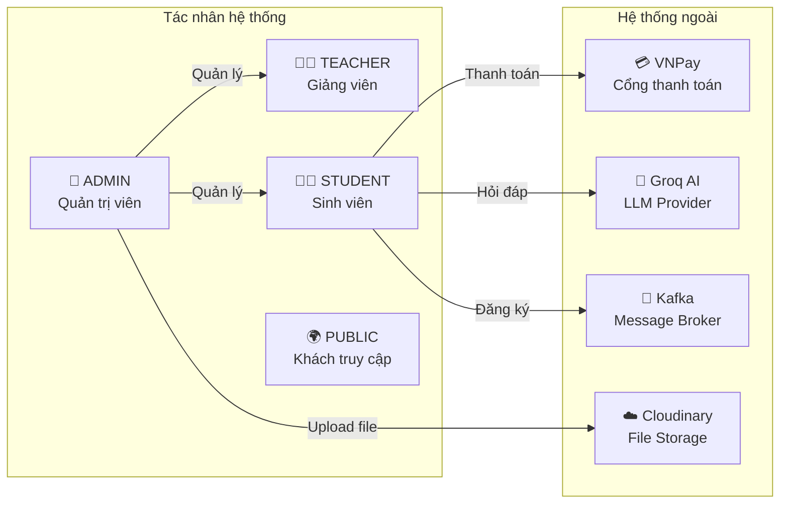

# 🔍 Phân Tích Nghiệp Vụ — ThangLong University Web

> **Mã tài liệu:** DOC-01  
> **Phiên bản:** 1.0  
> **Ngày tạo:** 28/05/2026  

---

## Mục Lục

- [1. Bối Cảnh Nghiệp Vụ](#1-bối-cảnh-nghiệp-vụ)
- [2. Các Tác Nhân Trong Hệ Thống](#2-các-tác-nhân-trong-hệ-thống)
- [3. Vai Trò và Quyền Hạn Từng Tác Nhân](#3-vai-trò-và-quyền-hạn-từng-tác-nhân)
- [4. Danh Sách Chức Năng Theo Vai Trò](#4-danh-sách-chức-năng-theo-vai-trò)
- [5. Bảng Phân Quyền Chức Năng](#5-bảng-phân-quyền-chức-năng)
- [6. Quy Trình Nghiệp Vụ Chính](#6-quy-trình-nghiệp-vụ-chính)
- [7. Các Business Rules Quan Trọng](#7-các-business-rules-quan-trọng)

---

## 1. Bối Cảnh Nghiệp Vụ

Trường Đại học Thăng Long (TLU) — thành lập năm 1988, là trường đại học ngoài công lập đầu tiên của Việt Nam. Hệ thống quản lý đại học **ThangLongUniversityWeb** được xây dựng để số hóa toàn bộ quy trình học thuật và hành chính của nhà trường.

**Bối cảnh hiện tại:**
- Quản lý nhiều ngành học (CNTT, Kinh tế, Ngoại ngữ, Quản trị kinh doanh, Luật...)
- Đào tạo theo hệ thống tín chỉ (credits-based)
- Sinh viên cần đăng ký học phần theo từng học kỳ
- Điểm được tính theo công thức: `0.1 × Chuyên cần + 0.3 × Giữa kỳ + 0.6 × Cuối kỳ`
- Hỗ trợ đăng ký thi lại (RETAKE) và học lại (IMPROVE)
- Thanh toán học phí tích hợp VNPay

---

## 2. Các Tác Nhân Trong Hệ Thống



| Tác nhân | Loại | Mô tả |
|----------|------|--------|
| **Admin** | Nội bộ | Quản trị viên hệ thống, toàn quyền truy cập |
| **Teacher** | Nội bộ | Giảng viên được tạo bởi Admin, quản lý lớp học của mình |
| **Student** | Nội bộ | Sinh viên được tạo bởi Admin, sử dụng các dịch vụ học tập |
| **Public** | Bên ngoài | Khách truy cập website marketing, không cần tài khoản |
| **VNPay** | Hệ thống ngoài | Cổng thanh toán học phí |
| **Groq AI** | Hệ thống ngoài | Mô hình ngôn ngữ cho chatbot |
| **Cloudinary** | Hệ thống ngoài | Lưu trữ file/ảnh |

---

## 3. Vai Trò và Quyền Hạn Từng Tác Nhân

### 3.1 Admin (ADMIN)

**Mô tả:** Quản trị viên hệ thống với quyền truy cập đầy đủ vào tất cả tính năng.

**Quyền hạn chính:**
- Tạo, sửa, xóa, kích hoạt/vô hiệu hóa tài khoản (Admin, Teacher, Student)
- Quản lý toàn bộ cấu trúc học thuật: Ngành, Khoa, Lớp niên chế, Phòng, Tiết
- Quản lý học kỳ: mở/đóng đăng ký, khóa điểm, xuất bản lịch thi
- Quản lý lớp học phần: tạo, phân công giảng viên, phòng học
- Xem tất cả danh sách đăng ký học phần, can thiệp admin override
- Quản lý lịch thi, đăng ký thi lại
- Xuất báo cáo Excel
- Quản lý knowledge base cho chatbot AI
- Xem nhật ký hệ thống (audit logs)
- Quản lý cài đặt hệ thống (system settings)

### 3.2 Teacher (TEACHER)

**Mô tả:** Giảng viên được phân công dạy các lớp học phần trong học kỳ.

**Quyền hạn chính:**
- Xem danh sách lớp học phần được phân công
- Xem danh sách sinh viên trong từng lớp
- Điểm danh sinh viên theo từng buổi học
- Khóa buổi điểm danh sau khi hoàn thành
- Nhập/cập nhật điểm (chuyên cần, giữa kỳ, cuối kỳ, thi lại)
- Khóa điểm cả lớp sau khi nhập xong
- Chat với sinh viên, giảng viên khác
- Xem và đánh dấu thông báo đã đọc
- Xem thời khóa biểu của mình

**Giới hạn:**
- Chỉ được nhập điểm cho lớp mình phụ trách
- Không thể nhập điểm sau khi lớp bị đóng hoặc điểm đã khóa

### 3.3 Student (STUDENT)

**Mô tả:** Sinh viên sử dụng hệ thống để quản lý việc học tập của mình.

**Quyền hạn chính:**
- Xem hồ sơ cá nhân
- Xem danh sách học kỳ và lớp học phần mở
- Đăng ký/hủy đăng ký học phần (trong thời gian mở đăng ký)
- Xem thời khóa biểu cá nhân
- Xem điểm số, GPA, CPA
- Xem lịch thi
- Đăng ký thi lại / học lại (khi semester mở)
- Xem và thanh toán học phí qua VNPay
- Chat với giảng viên và sinh viên khác
- Sử dụng chatbot AI để hỏi đáp
- Nhận và đọc thông báo
- Xem chương trình đào tạo

**Giới hạn:**
- Chỉ đăng ký được khi học kỳ mở đăng ký (`registrationOpen = true`)
- Không thể đăng ký nếu đã đủ slot (`currentSlots >= maxSlots`)
- Phải hoàn thành môn học tiên quyết trước khi đăng ký

---

## 4. Danh Sách Chức Năng Theo Vai Trò

### 4.1 Chức năng Admin

| # | Nhóm chức năng | Chức năng cụ thể |
|---|----------------|-----------------|
| 1 | **Quản lý người dùng** | Xem danh sách users, tạo admin, toggle trạng thái, xóa |
| 2 | **Quản lý sinh viên** | CRUD sinh viên, gán vào lớp niên chế |
| 3 | **Quản lý giảng viên** | CRUD giảng viên, gán khoa |
| 4 | **Quản lý ngành học** | CRUD ngành (Major) |
| 5 | **Quản lý khoa** | CRUD khoa (Department) |
| 6 | **Quản lý lớp niên chế** | CRUD Homeroom, thêm/xóa sinh viên vào lớp |
| 7 | **Quản lý môn học** | CRUD courses, điều kiện tiên quyết |
| 8 | **Quản lý phòng học** | CRUD rooms |
| 9 | **Quản lý tiết học** | CRUD periods (14 tiết/ngày) |
| 10 | **Quản lý học kỳ** | CRUD semesters, mở/đóng đăng ký, khóa điểm, xuất bản lịch thi, mở thi lại |
| 11 | **Quản lý lớp học phần** | CRUD class sections, lịch học, phân công GV, phòng học |
| 12 | **Quản lý đăng ký** | Xem danh sách enrollments, admin override |
| 13 | **Quản lý lịch thi** | Cài đặt lịch thi, phòng thi, loại thi |
| 14 | **Quản lý thi lại** | Xem đăng ký thi lại, tổng hợp |
| 15 | **Kết quả học tập** | Xem GPA/CPA toàn hệ thống |
| 16 | **Xuất báo cáo** | Xuất Excel: danh sách đăng ký, lịch thi, thi lại |
| 17 | **Quản lý knowledge** | Thêm/xóa tài liệu cho chatbot, reindex |
| 18 | **Dashboard** | Tổng quan hệ thống |
| 19 | **Chat** | Chat nội bộ |

### 4.2 Chức năng Teacher

| # | Nhóm chức năng | Chức năng cụ thể |
|---|----------------|-----------------|
| 1 | **Xem lớp học** | Danh sách lớp được phân công theo học kỳ |
| 2 | **Quản lý sinh viên** | Xem danh sách sinh viên trong lớp |
| 3 | **Điểm danh** | Xem/tạo buổi điểm danh, nhập trạng thái (Present/Late/Absent), khóa buổi |
| 4 | **Nhập điểm** | Nhập điểm chuyên cần, giữa kỳ, cuối kỳ, thi lại; khóa điểm cả lớp |
| 5 | **Thời khóa biểu** | Xem TKB của mình |
| 6 | **Thông báo** | Xem, đánh dấu đọc |
| 7 | **Chat** | Chat nội bộ |

### 4.3 Chức năng Student

| # | Nhóm chức năng | Chức năng cụ thể |
|---|----------------|-----------------|
| 1 | **Hồ sơ** | Xem thông tin cá nhân |
| 2 | **Dashboard** | Tổng quan GPA, CPA, TKB hôm nay, lịch thi sắp tới, học phí |
| 3 | **Đăng ký học phần** | Xem lớp mở, đăng ký, hủy, xem trạng thái xử lý |
| 4 | **Thời khóa biểu** | Xem TKB cá nhân theo học kỳ |
| 5 | **Điểm số** | Xem bảng điểm, GPA, CPA theo từng học kỳ |
| 6 | **Kết quả học tập** | Xem learning results tổng hợp |
| 7 | **Lịch thi** | Xem lịch thi theo học kỳ |
| 8 | **Đăng ký thi lại** | Xem môn đủ điều kiện, đăng ký/hủy thi lại |
| 9 | **Học phí** | Xem hóa đơn, thanh toán VNPay |
| 10 | **Chương trình đào tạo** | Xem tất cả môn học và môn theo ngành |
| 11 | **Thông báo** | Xem, đánh dấu đọc |
| 12 | **Chat** | Chat nội bộ |
| 13 | **Chatbot** | Hỏi đáp AI |

---

## 5. Bảng Phân Quyền Chức Năng

| Chức năng | Admin | Teacher | Student | Public |
|-----------|:-----:|:-------:|:-------:|:------:|
| Đăng nhập/Đăng xuất | ✅ | ✅ | ✅ | ❌ |
| Xem hồ sơ cá nhân | ✅ | ✅ | ✅ | ❌ |
| Quản lý Users | ✅ | ❌ | ❌ | ❌ |
| Quản lý Students | ✅ | ❌ | ❌ | ❌ |
| Quản lý Teachers | ✅ | ❌ | ❌ | ❌ |
| Quản lý Majors | ✅ | ❌ | ❌ | ❌ |
| Quản lý Departments | ✅ | ❌ | ❌ | ❌ |
| Quản lý Homerooms | ✅ | ❌ | ❌ | ❌ |
| Quản lý Courses | ✅ | ❌ | ❌ | ❌ |
| Quản lý Rooms | ✅ | ❌ | ❌ | ❌ |
| Quản lý Periods | ✅ | ❌ | ❌ | ❌ |
| Quản lý Semesters | ✅ | ❌ | ❌ | ❌ |
| Quản lý Class Sections | ✅ | ❌ | ❌ | ❌ |
| Xem lớp được phân công | ❌ | ✅ | ❌ | ❌ |
| Điểm danh | ❌ | ✅ | ❌ | ❌ |
| Nhập điểm | ❌ | ✅ | ❌ | ❌ |
| Đăng ký học phần | ❌ | ❌ | ✅ | ❌ |
| Xem thời khóa biểu | ❌ | ✅ | ✅ | ❌ |
| Xem điểm | ❌ | ✅ (lớp mình) | ✅ (của mình) | ❌ |
| Xem lịch thi | ✅ | ❌ | ✅ | ❌ |
| Đăng ký thi lại | ❌ | ❌ | ✅ | ❌ |
| Thanh toán học phí | ❌ | ❌ | ✅ | ❌ |
| Quản lý Knowledge | ✅ | ❌ | ❌ | ❌ |
| Chat | ✅ | ✅ | ✅ | ❌ |
| Chatbot | ✅ | ✅ | ✅ | ❌ |
| Thông báo | ❌ | ✅ | ✅ | ❌ |
| Xuất Excel | ✅ | ❌ | ❌ | ❌ |
| Xem website marketing | ✅ | ✅ | ✅ | ✅ |

---

## 6. Quy Trình Nghiệp Vụ Chính

### 6.1 Quy trình quản lý học kỳ

```
Admin tạo học kỳ mới
    ↓
Admin tạo lớp học phần (class sections)
    ↓
Admin phân công giảng viên, phòng học, lịch học
    ↓
Admin mở đăng ký (toggle-registration = open)
    ↓
Sinh viên đăng ký học phần (qua Kafka)
    ↓
Admin đóng đăng ký (toggle-registration = closed)
    ↓
Giảng viên điểm danh và nhập điểm
    ↓
Admin xuất bản lịch thi (publish-exams)
    ↓
Admin mở đăng ký thi lại (toggle-retake = open)
    ↓
Sinh viên đăng ký thi lại
    ↓
Admin khóa điểm (lock-retakes)
    ↓
Kết thúc học kỳ
```

### 6.2 Quy trình đăng ký học phần

```
Sinh viên → POST /api/student/enroll/{classSectionId}
    ↓ (async qua Kafka)
Kafka Producer → Topic: enrollment-requests
    ↓
Kafka Consumer → Kiểm tra:
  - Học kỳ có mở đăng ký không?
  - Còn slot không (currentSlots < maxSlots)?
  - Sinh viên đã đăng ký chưa?
  - Có conflict lịch học không?
    ↓
SUCCESS → Tạo Enrollment, cập nhật currentSlots
FAIL → Trả thông báo lỗi
    ↓
Sinh viên poll GET /api/student/enrollments/status/{requestId}
    ↓
Nhận kết quả: SUCCESS / FAILED
```

### 6.3 Quy trình tính điểm

```
Công thức tính điểm tổng kết:
total_score = 0.1 × participation_score (chuyên cần)
            + 0.3 × midterm_score (giữa kỳ)
            + 0.6 × final_score (cuối kỳ)

Nếu có thi lại: retest_score thay thế final_score

Xếp loại chữ (letter_grade):
  A  → 8.5 - 10.0 (gpa4 = 4.0)
  B  → 7.0 - 8.4  (gpa4 = 3.0)
  C  → 5.5 - 6.9  (gpa4 = 2.0)
  D  → 4.0 - 5.4  (gpa4 = 1.0)
  F  → < 4.0      (gpa4 = 0.0)
```

### 6.4 Quy trình thanh toán học phí

```
Sinh viên → GET /api/student/tuition/{semesterId}
    ↓ (Xem hóa đơn)
Sinh viên → POST /api/student/tuition/{semesterId}/vnpay-url
    ↓ (Tạo link VNPay)
VNPay → Thanh toán
    ↓
VNPay callback → GET /api/student/tuition/vnpay-return
    ↓
Backend xử lý kết quả:
  response_code = "00" → SUCCESS (cập nhật is_completed = true)
  Khác → FAILED
```

---

## 7. Các Business Rules Quan Trọng

Các rule nghiệp vụ được xác định trực tiếp từ source code:

| # | Business Rule | Nguồn xác định |
|---|--------------|----------------|
| BR-01 | Học kỳ phải ở trạng thái `registrationOpen = true` thì sinh viên mới được đăng ký | `StudentEnrollmentService` |
| BR-02 | Lớp học phần phải còn slot (`currentSlots < maxSlots`) mới được đăng ký | `StudentEnrollmentService` |
| BR-03 | Không thể đăng ký trùng lịch với lớp đã đăng ký | Kafka consumer validation |
| BR-04 | Điểm tổng kết = 10% chuyên cần + 30% giữa kỳ + 60% cuối kỳ | `grades` table comments |
| BR-05 | Giảng viên chỉ được nhập điểm cho lớp mình phụ trách | `TeacherGradeController` |
| BR-06 | Không thể nhập điểm khi lớp đã khóa (`grade_locked = true`) | `TeacherGradeController` |
| BR-07 | Nếu có thi lại, `retest_score` thay thế `final_score` trong tính điểm | `grades` table |
| BR-08 | Môn học có thể có điều kiện tiên quyết (prerequisite courses) | `course_prerequisites` table |
| BR-09 | Đăng ký thi lại chỉ mở khi học kỳ có `retakeOpen = true` | `SemesterManagementController` |
| BR-10 | Audit log ghi nhận tất cả thao tác quan trọng trong hệ thống | `audit_logs` table |
| BR-11 | Sinh viên không thể hủy đăng ký sau khi học kỳ đóng | `StudentEnrollmentService` |
| BR-12 | Lịch thi chỉ hiển thị cho sinh viên khi `examPublished = true` | `StudentSemesterResponse.examPublished` |
| BR-13 | Chat hỗ trợ 3 loại phòng: PRIVATE, GROUP, CLASS_GROUP | `chat_rooms.type` constraint |
| BR-14 | Tin nhắn chat hỗ trợ 3 loại: TEXT, IMAGE, FILE | `messages.type` constraint |
| BR-15 | Role của user gồm 3 giá trị: ADMIN, STUDENT, TEACHER | `users.role` check constraint |
| BR-16 | Trạng thái enrollment: PENDING, REGISTERED, CANCELED, PASSED, FAILED | `enrollments.status` constraint |
| BR-17 | Loại đăng ký môn: ORDINARY (thường), RETAKE (thi lại), IMPROVE (học lại) | `grades.enrollment_type` |
| BR-18 | Lịch học có thể có nhiều slot trong tuần (multi-day schedule) | `class_section_schedules` table |
| BR-19 | Ngày học theo số thứ: 2=Thứ 2, 3=Thứ 3... 8=Chủ nhật | `class_sections.day_of_week` comment |
| BR-20 | Tiết học từ tiết 1 (07:00) đến tiết 14 (19:45) | `periods` seed data |

---

> 📌 **Lưu ý:** Các business rules này được xác định trực tiếp từ code, database schema và comments trong source code của dự án.
