# 📊 Use Case — ThangLong University Web

> **Mã tài liệu:** DOC-04  
> **Phiên bản:** 1.0  
> **Ngày tạo:** 28/05/2026  

---

## Mục Lục

- [1. Sơ Đồ Use Case Tổng Quan](#1-sơ-đồ-use-case-tổng-quan)
- [2. Bảng Use Case Theo Actor](#2-bảng-use-case-theo-actor)
- [3. Mô Tả Chi Tiết Use Case Chính](#3-mô-tả-chi-tiết-use-case-chính)

---

## 1. Sơ Đồ Use Case Tổng Quan

```mermaid
graph LR
    ADMIN([👑 Admin])
    TEACHER([👨‍🏫 Teacher])
    STUDENT([👨‍🎓 Student])
    PUBLIC([🌍 Public])

    subgraph "🔐 Xác Thực"
        UC1[Đăng nhập]
        UC2[Đăng xuất]
        UC3[Xem hồ sơ]
    end

    subgraph "👑 Admin Portal"
        UC4[Quản lý Users]
        UC5[Quản lý Sinh viên]
        UC6[Quản lý Giảng viên]
        UC7[Quản lý Ngành/Khoa]
        UC8[Quản lý Phòng/Tiết]
        UC9[Quản lý Môn học]
        UC10[Quản lý Học kỳ]
        UC11[Quản lý Lớp HP]
        UC12[Quản lý Đăng ký]
        UC13[Quản lý Lịch thi]
        UC14[Quản lý Knowledge]
        UC15[Xuất Excel]
    end

    subgraph "👨‍🏫 Teacher Portal"
        UC16[Xem lớp phân công]
        UC17[Điểm danh]
        UC18[Nhập điểm]
        UC19[Khóa điểm]
    end

    subgraph "👨‍🎓 Student Portal"
        UC20[Đăng ký học phần]
        UC21[Xem TKB]
        UC22[Xem điểm/GPA]
        UC23[Đăng ký thi lại]
        UC24[Thanh toán học phí]
        UC25[Xem lịch thi]
    end

    subgraph "💬 Chung"
        UC26[Chat nội bộ]
        UC27[Chatbot AI]
        UC28[Thông báo]
    end

    subgraph "🌐 Marketing"
        UC29[Xem website]
        UC30[Tuyển sinh]
    end

    ADMIN --> UC1
    ADMIN --> UC4
    ADMIN --> UC5
    ADMIN --> UC6
    ADMIN --> UC7
    ADMIN --> UC8
    ADMIN --> UC9
    ADMIN --> UC10
    ADMIN --> UC11
    ADMIN --> UC12
    ADMIN --> UC13
    ADMIN --> UC14
    ADMIN --> UC15
    ADMIN --> UC26
    ADMIN --> UC27

    TEACHER --> UC1
    TEACHER --> UC3
    TEACHER --> UC16
    TEACHER --> UC17
    TEACHER --> UC18
    TEACHER --> UC19
    TEACHER --> UC26
    TEACHER --> UC27
    TEACHER --> UC28

    STUDENT --> UC1
    STUDENT --> UC3
    STUDENT --> UC20
    STUDENT --> UC21
    STUDENT --> UC22
    STUDENT --> UC23
    STUDENT --> UC24
    STUDENT --> UC25
    STUDENT --> UC26
    STUDENT --> UC27
    STUDENT --> UC28

    PUBLIC --> UC29
    PUBLIC --> UC30
```



---

## 2. Bảng Use Case Theo Actor

### 2.1 Admin Use Cases

| UC-ID | Tên Use Case | Mô tả ngắn | Độ ưu tiên |
|-------|-------------|------------|-----------|
| UC-A01 | Đăng nhập | Đăng nhập với role ADMIN | 🔴 Cao |
| UC-A02 | Quản lý tài khoản | CRUD users, toggle trạng thái | 🔴 Cao |
| UC-A03 | Quản lý sinh viên | CRUD student profiles | 🔴 Cao |
| UC-A04 | Quản lý giảng viên | CRUD teacher profiles | 🔴 Cao |
| UC-A05 | Quản lý ngành & khoa | CRUD majors, departments | 🟡 Trung bình |
| UC-A06 | Quản lý lớp niên chế | CRUD homerooms, gán sinh viên | 🟡 Trung bình |
| UC-A07 | Quản lý môn học | CRUD courses, prerequisites | 🔴 Cao |
| UC-A08 | Quản lý phòng & tiết | CRUD rooms, periods | 🟡 Trung bình |
| UC-A09 | Quản lý học kỳ | CRUD semesters, toggle flags | 🔴 Cao |
| UC-A10 | Quản lý lớp học phần | CRUD class sections | 🔴 Cao |
| UC-A11 | Quản lý lịch thi | Cài đặt exam schedules | 🔴 Cao |
| UC-A12 | Quản lý đăng ký | Xem, override enrollments | 🟡 Trung bình |
| UC-A13 | Quản lý thi lại | Xem exam registrations | 🟡 Trung bình |
| UC-A14 | Xuất báo cáo | Export Excel | 🟡 Trung bình |
| UC-A15 | Quản lý Knowledge | CRUD knowledge documents | 🟢 Thấp |

### 2.2 Teacher Use Cases

| UC-ID | Tên Use Case | Mô tả ngắn | Độ ưu tiên |
|-------|-------------|------------|-----------|
| UC-T01 | Đăng nhập | Đăng nhập với role TEACHER | 🔴 Cao |
| UC-T02 | Xem lớp phân công | Danh sách lớp theo học kỳ | 🔴 Cao |
| UC-T03 | Xem sinh viên lớp | DS sinh viên trong lớp | 🔴 Cao |
| UC-T04 | Điểm danh buổi học | Nhập attendance records | 🔴 Cao |
| UC-T05 | Khóa buổi điểm danh | Lock attendance session | 🟡 Trung bình |
| UC-T06 | Nhập điểm | Nhập các thành phần điểm | 🔴 Cao |
| UC-T07 | Khóa điểm lớp | Lock class grades | 🟡 Trung bình |
| UC-T08 | Xem thời khóa biểu | TKB của giảng viên | 🟡 Trung bình |
| UC-T09 | Chat | Chat với SV/GV khác | 🟢 Thấp |
| UC-T10 | Thông báo | Xem notifications | 🟢 Thấp |

### 2.3 Student Use Cases

| UC-ID | Tên Use Case | Mô tả ngắn | Độ ưu tiên |
|-------|-------------|------------|-----------|
| UC-S01 | Đăng nhập | Đăng nhập với role STUDENT | 🔴 Cao |
| UC-S02 | Xem dashboard | Tổng quan GPA, TKB, lịch thi | 🔴 Cao |
| UC-S03 | Đăng ký học phần | Enroll vào class section | 🔴 Cao |
| UC-S04 | Hủy đăng ký | Cancel enrollment | 🔴 Cao |
| UC-S05 | Xem thời khóa biểu | TKB cá nhân | 🔴 Cao |
| UC-S06 | Xem điểm | Bảng điểm, GPA, CPA | 🔴 Cao |
| UC-S07 | Xem lịch thi | Exam schedule | 🟡 Trung bình |
| UC-S08 | Đăng ký thi lại | Retake/Improve registration | 🟡 Trung bình |
| UC-S09 | Thanh toán học phí | VNPay payment | 🔴 Cao |
| UC-S10 | Xem chương trình ĐT | Curriculum | 🟢 Thấp |
| UC-S11 | Chat | Chat nội bộ | 🟢 Thấp |
| UC-S12 | Chatbot | AI assistant | 🟢 Thấp |
| UC-S13 | Thông báo | Notifications | 🟡 Trung bình |

---

## 3. Mô Tả Chi Tiết Use Case Chính

---

### UC-S01 — Đăng Nhập Hệ Thống

| Trường | Nội dung |
|--------|---------|
| **Use Case ID** | UC-S01 |
| **Tên Use Case** | Đăng nhập hệ thống |
| **Actor** | Admin, Teacher, Student |
| **Mục tiêu** | Xác thực danh tính và nhận JWT tokens để truy cập hệ thống |
| **Tiền điều kiện** | Tài khoản tồn tại và đang active trong hệ thống |
| **Hậu điều kiện** | User được redirect đến portal tương ứng theo role |

**Luồng chính:**

```
1. User truy cập trang /login
2. User nhập username và password
3. Frontend gửi POST /api/auth/login với {username, password}
4. Backend xác thực credentials trong database
5. Backend tạo accessToken và refreshToken (JWT)
6. Backend trả về {accessToken, refreshToken, role}
7. Frontend lưu tokens vào localStorage
8. Frontend đọc role:
   - ADMIN → redirect /admin/dashboard
   - TEACHER → redirect /teacher/dashboard
   - STUDENT → redirect /student/dashboard
```

**Luồng thay thế:**

```
4a. Username không tồn tại hoặc password sai:
    → Backend trả về 401 Unauthorized
    → Frontend hiển thị thông báo lỗi "Sai thông tin đăng nhập"
    → Quay về bước 2

4b. Tài khoản bị vô hiệu hóa (is_active = false):
    → Backend trả về 401 với message tương ứng
    → Frontend hiển thị thông báo
```

---

### UC-S03 — Đăng Ký Học Phần (Async via Kafka)

| Trường | Nội dung |
|--------|---------|
| **Use Case ID** | UC-S03 |
| **Tên Use Case** | Đăng ký học phần |
| **Actor** | Student |
| **Mục tiêu** | Sinh viên đăng ký vào một lớp học phần trong học kỳ mở đăng ký |
| **Tiền điều kiện** | Student đã đăng nhập; Học kỳ đang mở đăng ký (`registrationOpen = true`); Lớp còn slot |
| **Hậu điều kiện** | Enrollment được tạo, `currentSlots` tăng thêm 1 |

**Luồng chính:**

```
1. Student xem danh sách lớp học phần GET /api/student/classes/semester/{semesterId}
2. Student chọn lớp muốn đăng ký
3. Frontend gửi POST /api/student/enroll/{classSectionId}
4. Backend gửi yêu cầu vào Kafka topic (enrollment-requests)
5. Backend trả về {requestId, message: "Đang xử lý..."}
6. Frontend poll GET /api/student/enrollments/status/{requestId}
7. Kafka consumer xử lý:
   a. Kiểm tra học kỳ mở đăng ký
   b. Kiểm tra còn slot
   c. Kiểm tra trùng lịch học
   d. Kiểm tra môn tiên quyết (nếu có)
   e. Tạo Enrollment, cập nhật currentSlots
8. Frontend nhận status = SUCCESS → hiển thị xác nhận
```

**Luồng thay thế:**

```
7a. Học kỳ đóng đăng ký → status = FAILED, message = "Học kỳ không mở đăng ký"
7b. Lớp đầy slot → status = FAILED, message = "Lớp đã đầy"
7c. Trùng lịch học → status = FAILED, message = "Xung đột lịch học"
7d. Đã đăng ký rồi → status = FAILED, message = "Đã đăng ký lớp này"
```

---

### UC-T06 — Nhập Điểm Sinh Viên

| Trường | Nội dung |
|--------|---------|
| **Use Case ID** | UC-T06 |
| **Tên Use Case** | Nhập điểm sinh viên |
| **Actor** | Teacher |
| **Mục tiêu** | Giảng viên nhập các thành phần điểm cho sinh viên trong lớp mình phụ trách |
| **Tiền điều kiện** | Giảng viên đã đăng nhập; Lớp học phần chưa khóa điểm (`grade_locked = false`); Giảng viên là người dạy lớp đó |
| **Hậu điều kiện** | Điểm được lưu vào bảng `grades`, total_score được tính tự động |

**Luồng chính:**

```
1. Teacher chọn học kỳ → xem danh sách lớp GET /api/teacher/my-classes/semester/{semesterId}
2. Teacher chọn lớp → xem danh sách sinh viên GET /api/teacher/classes/{classSectionId}/students
3. Teacher nhập điểm cho từng sinh viên:
   PUT /api/teacher/grades/{enrollmentId}
   Body: {participationScore, midTermScore, finalScore, retestScore?}
4. Backend kiểm tra:
   a. Teacher có phải người dạy lớp không?
   b. Lớp có đang mở không (isClosed = false)?
   c. Grade_locked = false?
5. Backend lưu điểm, tính total_score
6. Backend trả về GradeResponse
```

**Luồng thay thế:**

```
4a. Teacher không phải người dạy lớp → 403 Forbidden
4b. Lớp đã đóng hoặc grade_locked → 400 Bad Request
4c. Trường hợp thi lại: Kiểm tra xem SV có đăng ký thi lại và GV có phụ trách lớp thi lại không
```

---

### UC-S09 — Thanh Toán Học Phí (VNPay)

| Trường | Nội dung |
|--------|---------|
| **Use Case ID** | UC-S09 |
| **Tên Use Case** | Thanh toán học phí qua VNPay |
| **Actor** | Student |
| **Mục tiêu** | Sinh viên thanh toán học phí học kỳ qua cổng VNPay |
| **Tiền điều kiện** | Sinh viên đã đăng nhập; Có hóa đơn học phí chưa thanh toán |
| **Hậu điều kiện** | Hóa đơn được đánh dấu đã thanh toán (`is_completed = true`) |

**Luồng chính:**

```
1. Student xem hóa đơn GET /api/student/tuition/{semesterId}
2. Student xem chi tiết: từng môn học, số tín chỉ, đơn giá, tổng tiền
3. Student click "Thanh toán" → POST /api/student/tuition/{semesterId}/vnpay-url
4. Backend tạo VNPay payment URL với mã giao dịch duy nhất (txn_ref)
5. Frontend redirect đến VNPay checkout page
6. Student nhập thông tin thẻ (ngân hàng NCB, số thẻ test, OTP)
7. VNPay xử lý giao dịch
8. VNPay redirect về GET /api/student/tuition/vnpay-return?...
9. Backend kiểm tra response_code = "00" → SUCCESS
10. Backend cập nhật:
    - payment_transactions.status = SUCCESS
    - tuition_bills.is_completed = true
11. Frontend hiển thị trang kết quả thành công /student/payment-result
```

**Luồng thay thế:**

```
9a. response_code ≠ "00" → FAILED
    → payment_transactions.status = FAILED
    → Frontend hiển thị thất bại, cho phép thử lại
```

---

### UC-T04 — Điểm Danh Sinh Viên

| Trường | Nội dung |
|--------|---------|
| **Use Case ID** | UC-T04 |
| **Tên Use Case** | Điểm danh buổi học |
| **Actor** | Teacher |
| **Mục tiêu** | Ghi nhận điểm danh sinh viên cho từng buổi học |
| **Tiền điều kiện** | Teacher đã đăng nhập; Buổi điểm danh chưa bị khóa |
| **Hậu điều kiện** | Attendance records được lưu cho buổi học đó |

**Luồng chính:**

```
1. Teacher chọn lớp → xem danh sách buổi
   GET /api/teacher/classes/{classSectionId}/attendance-sessions
2. Teacher chọn buổi học cụ thể
   GET /api/teacher/classes/{classSectionId}/attendance-sessions/{sessionNumber}
3. Teacher thấy danh sách sinh viên + trạng thái hiện tại
4. Teacher chọn trạng thái cho từng SV: PRESENT / LATE / ABSENT
5. Teacher lưu điểm danh:
   PUT /api/teacher/classes/{classSectionId}/attendance-sessions/{sessionNumber}/records
   Body: [{enrollmentId, status, note?}, ...]
6. Backend lưu records, trả về AttendanceSessionResponse
7. (Tùy chọn) Teacher khóa buổi điểm danh:
   POST /api/teacher/classes/{classSectionId}/attendance-sessions/{sessionNumber}/lock
```

**Luồng thay thế:**

```
7a. Buổi đã khóa (locked = true) → không thể sửa nữa
```

---

### UC-A09 — Quản Lý Học Kỳ

| Trường | Nội dung |
|--------|---------|
| **Use Case ID** | UC-A09 |
| **Tên Use Case** | Quản lý học kỳ |
| **Actor** | Admin |
| **Mục tiêu** | Admin điều hành toàn bộ vòng đời của một học kỳ |
| **Tiền điều kiện** | Admin đã đăng nhập |
| **Hậu điều kiện** | Học kỳ ở trạng thái mong muốn |

**Luồng chính (vòng đời học kỳ):**

```
1. Admin tạo học kỳ mới:
   POST /api/admin/semesters
   Body: {name, startDate, endDate, registrationOpen: false}

2. Admin tạo lớp học phần cho học kỳ:
   POST /api/admin/class-sections

3. Admin mở đăng ký:
   POST /api/admin/semesters/{id}/toggle-registration
   Body: {open: true}

4. [Sinh viên đăng ký học phần]

5. Admin đóng đăng ký:
   POST /api/admin/semesters/{id}/toggle-registration
   Body: {open: false}

6. [Giảng viên dạy học, điểm danh, nhập điểm]

7. Admin cài đặt lịch thi:
   PUT /api/admin/class-sections/semester/{id}/exam-schedules

8. Admin xuất bản lịch thi:
   POST /api/admin/semesters/{id}/publish-exams

9. [Sinh viên xem lịch thi]

10. Admin mở đăng ký thi lại:
    POST /api/admin/semesters/{id}/toggle-retake
    Body: {open: true}

11. [Sinh viên đăng ký thi lại]

12. Admin khóa đăng ký thi lại:
    POST /api/admin/semesters/{id}/lock-retakes

13. [Giảng viên nhập điểm thi lại, khóa điểm]

14. Học kỳ kết thúc
```

---

> 📌 **Lưu ý:** Các use case trên được xây dựng hoàn toàn dựa trên source code và API thực tế của hệ thống.
