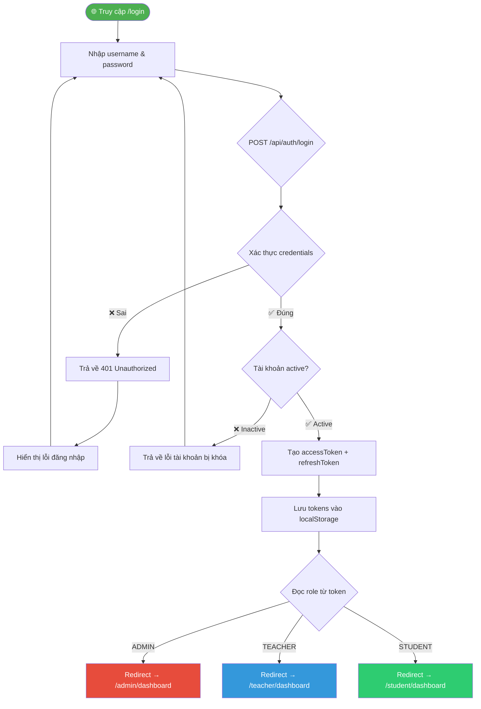
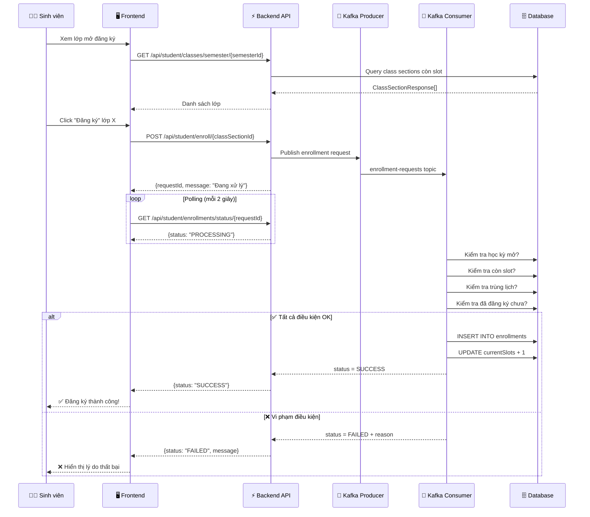
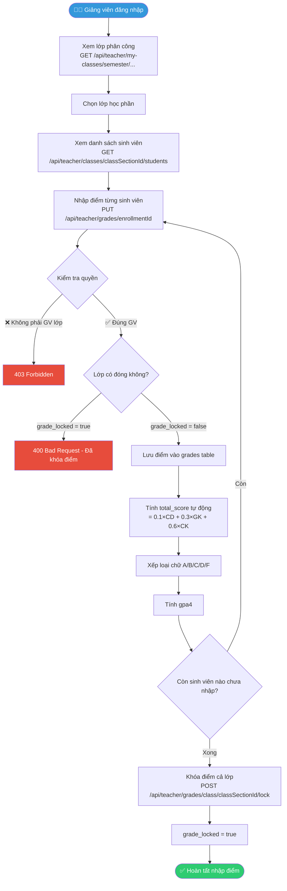
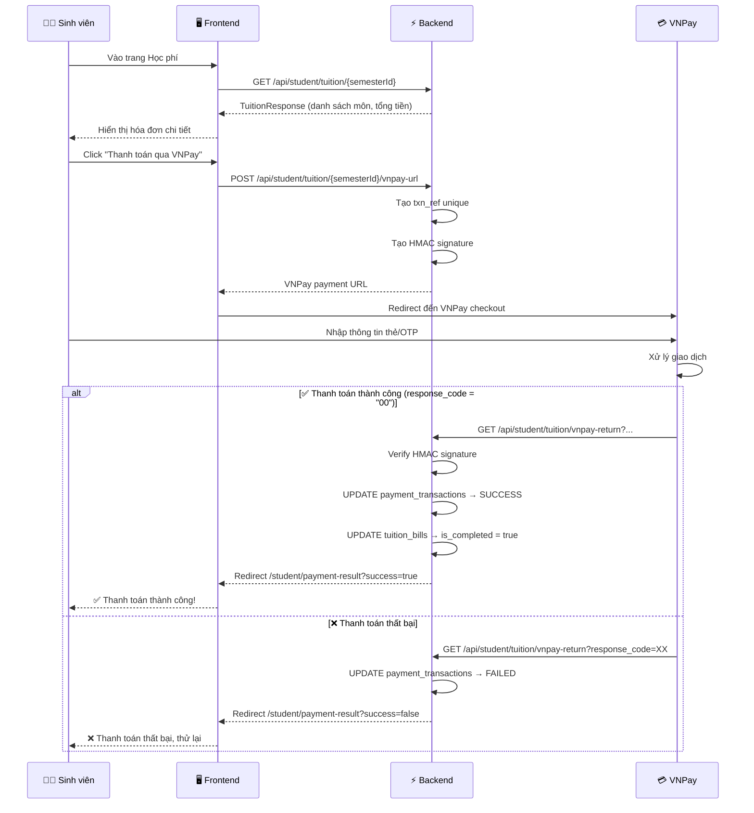
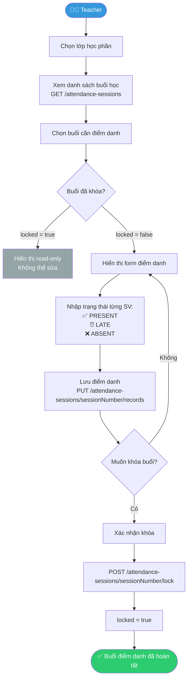

# 🔄 Quy Trình Nghiệp Vụ — ThangLong University Web

> **Mã tài liệu:** DOC-05  
> **Phiên bản:** 1.0  
> **Ngày tạo:** 28/05/2026  

---

## Mục Lục

- [1. Quy Trình Đăng Nhập & Phân Quyền](#1-quy-trình-đăng-nhập--phân-quyền)
- [2. Quy Trình Đăng Ký Học Phần (Kafka)](#2-quy-trình-đăng-ký-học-phần-kafka)
- [3. Quy Trình Nhập Điểm & Khóa Điểm](#3-quy-trình-nhập-điểm--khóa-điểm)
- [4. Quy Trình Thanh Toán Học Phí VNPay](#4-quy-trình-thanh-toán-học-phí-vnpay)
- [5. Quy Trình Quản Lý Học Kỳ (Vòng đời)](#5-quy-trình-quản-lý-học-kỳ-vòng-đời)
- [6. Quy Trình Điểm Danh](#6-quy-trình-điểm-danh)
- [7. Quy Trình Đăng Ký Thi Lại](#7-quy-trình-đăng-ký-thi-lại)

---

## 1. Quy Trình Đăng Nhập & Phân Quyền

**Mục đích:** Xác thực người dùng và điều hướng đến portal phù hợp theo role.

**Actor tham gia:** Admin, Teacher, Student

**Đầu vào:** Username, Password  
**Đầu ra:** JWT Tokens + redirect đến portal tương ứng



**Exception:**
- Quá số lần đăng nhập sai → Chưa xác định từ source code (cần bổ sung)
- Token hết hạn → Tự động refresh qua `POST /api/auth/refresh`

---

## 2. Quy Trình Đăng Ký Học Phần (Kafka)

**Mục đích:** Sinh viên đăng ký học phần với xử lý bất đồng bộ để tránh quá tải.

**Actor tham gia:** Student, Kafka System

**Đầu vào:** classSectionId  
**Đầu ra:** Enrollment record trong database



**Business rules trong quy trình này:**
- `registrationOpen = true` → Điều kiện bắt buộc
- `currentSlots < maxSlots` → Còn chỗ trống
- Không trùng ngày/tiết với lớp đã đăng ký
- Chưa đăng ký lớp này trước đó

---

## 3. Quy Trình Nhập Điểm & Khóa Điểm

**Mục đích:** Giảng viên nhập điểm các thành phần cho từng sinh viên và khóa điểm khi hoàn tất.

**Actor tham gia:** Teacher

**Đầu vào:** enrollmentId, {participationScore, midTermScore, finalScore, retestScore}  
**Đầu ra:** Grade record cập nhật, letter_grade và gpa4 được tính



**Công thức tính điểm:**
```
total_score = (participation_score × 0.1) + (midterm_score × 0.3) + (final_score × 0.6)

Nếu có retest_score: thay thế final_score trong công thức

Xếp loại chữ:
  ≥ 8.5  → A (gpa4 = 4.0)
  ≥ 7.0  → B (gpa4 = 3.0)
  ≥ 5.5  → C (gpa4 = 2.0)
  ≥ 4.0  → D (gpa4 = 1.0)
  < 4.0  → F (gpa4 = 0.0)
```

---

## 4. Quy Trình Thanh Toán Học Phí VNPay

**Mục đích:** Sinh viên thanh toán học phí qua cổng VNPay.

**Actor tham gia:** Student, VNPay System

**Đầu vào:** semesterId  
**Đầu ra:** TuitionBill.is_completed = true



---

## 5. Quy Trình Quản Lý Học Kỳ (Vòng Đời)

**Mục đích:** Mô tả toàn bộ vòng đời của một học kỳ từ khi tạo đến khi kết thúc.

**Actor tham gia:** Admin, Teacher, Student



```mermaid
flowchart LR
    A([Tạo Học Kỳ]) --> B[Tạo Lớp HP\n& Phân công GV]
    B --> C{Mở Đăng Ký\ntoggle-registration}
    C --> D[Sinh viên\nĐăng ký HP]
    D --> E{Đóng Đăng Ký}
    E --> F[GV Điểm Danh\n& Dạy Học]
    F --> G[GV Nhập Điểm\n& Khóa Điểm]
    G --> H[Admin Cài\nLịch Thi]
    H --> I{Xuất Bản\nLịch Thi\npublish-exams}
    I --> J[SV Xem\nLịch Thi]
    J --> K{Mở Đăng Ký\nThi Lại}
    K --> L[SV Đăng Ký\nThi Lại]
    L --> M{Khóa\nĐăng Ký Thi Lại}
    M --> N[GV Nhập Điểm\nThi Lại]
    N --> O([Kết Thúc\nHọc Kỳ])

    style A fill:#27ae60,color:#fff
    style O fill:#8e44ad,color:#fff
    style C fill:#e67e22,color:#fff
    style I fill:#2980b9,color:#fff
    style K fill:#e67e22,color:#fff
    style M fill:#c0392b,color:#fff
```

**Trạng thái học kỳ và flags:**

| Flag | Giá trị | Ý nghĩa |
|------|---------|---------|
| `registrationOpen` | true/false | Sinh viên có thể đăng ký học phần |
| `locked` | true/false | Học kỳ đã đóng băng (không thể thay đổi enrollments) |
| `examPublished` | true/false | Lịch thi đã công bố cho sinh viên |
| `retakeOpen` | true/false | Sinh viên có thể đăng ký thi lại |
| `retakeLocked` | true/false | Đăng ký thi lại đã đóng |

---

## 6. Quy Trình Điểm Danh

**Mục đích:** Ghi nhận sự có mặt của sinh viên trong từng buổi học.

**Actor tham gia:** Teacher

**Đầu vào:** classSectionId, sessionNumber, danh sách trạng thái điểm danh  
**Đầu ra:** AttendanceRecord cho từng sinh viên trong buổi học



**Trạng thái điểm danh:**
- `PRESENT` — Có mặt đầy đủ
- `LATE` — Đi muộn
- `ABSENT` — Vắng mặt

**Ghi chú:**
- Số buổi vắng ảnh hưởng đến `courseStatus` (có thể bị `BANNED_FROM_EXAM` nếu vắng quá nhiều)
- Thông tin này hiển thị trong bảng điểm giảng viên qua `absenceCount`

---

## 7. Quy Trình Đăng Ký Thi Lại

**Mục đích:** Sinh viên đăng ký thi lại (RETAKE) hoặc học lại (IMPROVE) cho các môn chưa đạt.

**Actor tham gia:** Student

**Đầu vào:** Danh sách courseIds, semesterId  
**Đầu ra:** ExamRegistration records, thông báo tổng phí

```mermaid
flowchart TD
    A([👨‍🎓 Sinh viên]) --> B{Học kỳ mở\nthi lại?}
    B -->|retakeOpen = false| C[Thông báo: Chưa mở đăng ký thi lại]
    B -->|retakeOpen = true| D[Xem môn đủ điều kiện\nGET /api/student/retakes/eligible-courses]
    D --> E[Hệ thống hiển thị:\n- Môn trượt RETAKE\n- Môn muốn cải thiện IMPROVE\n- Phí thi lại từng môn]
    E --> F[SV chọn môn muốn đăng ký]
    F --> G[POST /api/student/retakes/register\n{courseIds, semesterId}]
    G --> H{Xác nhận đăng ký}
    H -->|Thành công| I[ExamRegistration được tạo]
    I --> J[Hiển thị:\n- DS môn đã đăng ký\n- Tổng phí thi lại\n- Lịch thi nếu đã có]
    J --> K{Muốn hủy?}
    K -->|Có| L[DELETE /api/student/retakes/examRegistrationId]
    L --> D
    K -->|Không| M([✅ Hoàn tất đăng ký thi lại])

    style A fill:#3498db,color:#fff
    style M fill:#2ecc71,color:#fff
    style C fill:#e74c3c,color:#fff
```

**Điều kiện đủ điều kiện thi lại:**
- Môn có điểm < 4.0 (RETAKE — thi lại)
- Môn có điểm ≥ 4.0 nhưng muốn cải thiện (IMPROVE — học lại)
- Học kỳ đang mở đăng ký thi lại (`retakeOpen = true`)

---

> 📌 **Lưu ý:** Tất cả các flowchart và sequence diagram trên được xây dựng dựa trên phân tích source code và API endpoints thực tế của dự án.
