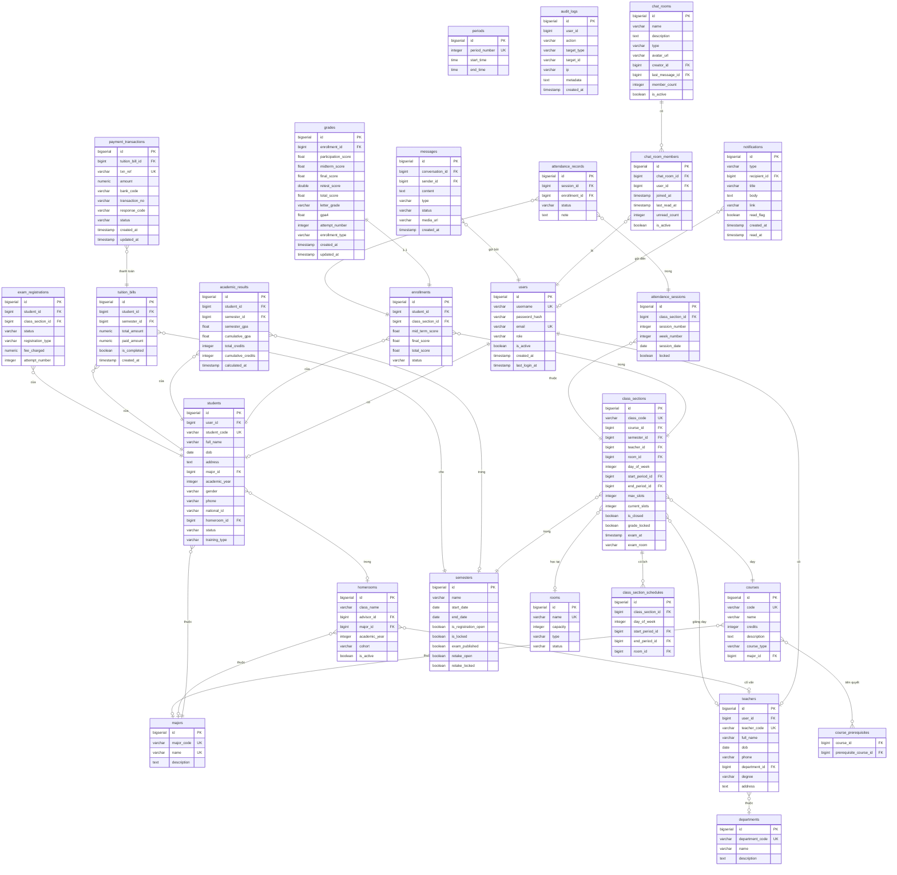
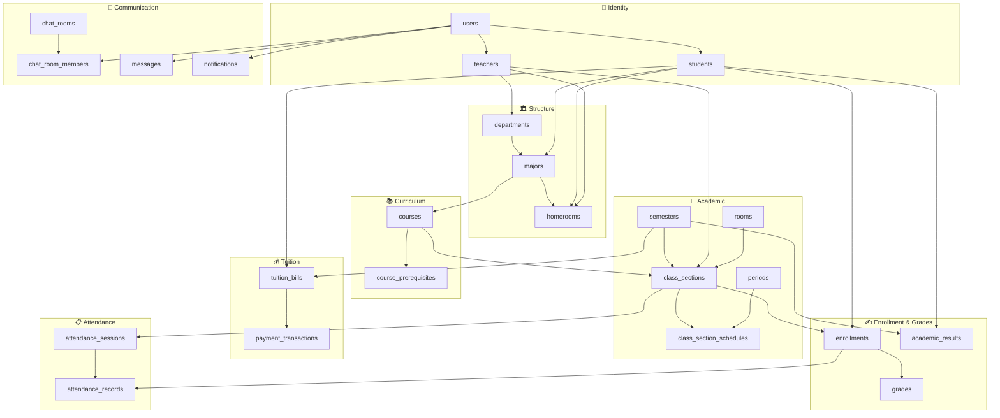

# 🗄️ Mô Hình Dữ Liệu — ThangLong University Web

> **Mã tài liệu:** DOC-07 | **Phiên bản:** 1.0 | **Ngày tạo:** 28/05/2026

---

## Mục Lục
- [1. ERD Tổng Quan](#1-erd-tổng-quan)
- [2. Mô Tả Chi Tiết Từng Entity](#2-mô-tả-chi-tiết-từng-entity)
- [3. Mối Quan Hệ Dữ Liệu](#3-mối-quan-hệ-dữ-liệu)

---

## 1. ERD Tổng Quan

---

## 2. Mô Tả Chi Tiết Từng Entity

### 2.1 users — Tài khoản hệ thống

| Field | Kiểu | Ràng buộc | Mô tả |
|-------|------|-----------|-------|
| `id` | BIGSERIAL | PK | Auto-increment |
| `username` | VARCHAR(255) | NOT NULL, UNIQUE | Tên đăng nhập |
| `password_hash` | VARCHAR(255) | NOT NULL | BCrypt hash |
| `email` | VARCHAR(255) | NOT NULL, UNIQUE | Email |
| `role` | VARCHAR(20) | CHECK IN ('ADMIN','STUDENT','TEACHER') | Vai trò |
| `is_active` | BOOLEAN | DEFAULT TRUE | Trạng thái kích hoạt |
| `created_at` | TIMESTAMP | DEFAULT NOW() | Ngày tạo |
| `last_login_at` | TIMESTAMP | — | Lần đăng nhập cuối |

### 2.2 students — Hồ sơ sinh viên

| Field | Kiểu | Ràng buộc | Mô tả |
|-------|------|-----------|-------|
| `id` | BIGSERIAL | PK | — |
| `user_id` | BIGINT | FK users, UNIQUE | Liên kết tài khoản |
| `student_code` | VARCHAR(50) | NOT NULL, UNIQUE | Mã sinh viên |
| `full_name` | VARCHAR(255) | — | Họ tên đầy đủ |
| `dob` | DATE | — | Ngày sinh |
| `major_id` | BIGINT | FK majors | Ngành học |
| `academic_year` | INTEGER | — | Năm học (VD: 2022) |
| `gender` | VARCHAR | — | Giới tính |
| `homeroom_id` | BIGINT | FK homerooms | Lớp niên chế |
| `status` | VARCHAR | — | Trạng thái học |
| `training_type` | VARCHAR | — | Loại hình đào tạo |

### 2.3 teachers — Hồ sơ giảng viên

| Field | Kiểu | Ràng buộc | Mô tả |
|-------|------|-----------|-------|
| `id` | BIGSERIAL | PK | — |
| `user_id` | BIGINT | FK users, UNIQUE | Liên kết tài khoản |
| `teacher_code` | VARCHAR(50) | NOT NULL, UNIQUE | Mã giảng viên |
| `full_name` | VARCHAR(255) | — | Họ tên |
| `department_id` | BIGINT | FK departments | Khoa |
| `degree` | VARCHAR(100) | — | Học vị (Thạc sĩ, Tiến sĩ...) |
| `phone` | VARCHAR(20) | — | Điện thoại |
| `status` | VARCHAR | CHECK IN ('DANG_GIANG_DAY','NGHI_PHEP','DA_NGHI_VIEC') | Trạng thái |

### 2.4 class_sections — Lớp học phần

| Field | Kiểu | Ràng buộc | Mô tả |
|-------|------|-----------|-------|
| `id` | BIGSERIAL | PK | — |
| `class_code` | VARCHAR(100) | NOT NULL, UNIQUE | Mã lớp HP |
| `course_id` | BIGINT | FK courses | Môn học |
| `semester_id` | BIGINT | FK semesters | Học kỳ |
| `teacher_id` | BIGINT | FK teachers | Giảng viên |
| `max_slots` | INTEGER | — | Số chỗ tối đa |
| `current_slots` | INTEGER | DEFAULT 0 | Số SV hiện tại |
| `is_closed` | BOOLEAN | DEFAULT FALSE | Lớp đóng hay mở |
| `grade_locked` | BOOLEAN | DEFAULT FALSE | Điểm đã khóa |
| `exam_at` | TIMESTAMP | — | Ngày giờ thi |
| `exam_room` | VARCHAR(255) | — | Phòng thi |

### 2.5 enrollments — Đăng ký học phần

| Field | Kiểu | Ràng buộc | Mô tả |
|-------|------|-----------|-------|
| `id` | BIGSERIAL | PK | — |
| `student_id` | BIGINT | FK students | Sinh viên |
| `class_section_id` | BIGINT | FK class_sections | Lớp HP |
| `status` | VARCHAR(30) | CHECK IN ('PENDING','REGISTERED','CANCELED','PASSED','FAILED') | Trạng thái |
| `mid_term_score` | FLOAT | — | Điểm giữa kỳ (denorm) |
| `final_score` | FLOAT | — | Điểm cuối kỳ (denorm) |
| `total_score` | FLOAT | — | Điểm tổng kết (denorm) |
| UNIQUE | | (student_id, class_section_id) | Không đăng ký 2 lần |

### 2.6 grades — Bảng điểm chi tiết

| Field | Kiểu | Mô tả |
|-------|------|-------|
| `enrollment_id` | BIGINT | FK enrollments (1-1) |
| `participation_score` | FLOAT | Chuyên cần (0-10), trọng số 10% |
| `midterm_score` | FLOAT | Giữa kỳ (0-10), trọng số 30% |
| `final_score` | FLOAT | Cuối kỳ (0-10), trọng số 60% |
| `retest_score` | DOUBLE | Điểm thi lại (thay final nếu có) |
| `total_score` | FLOAT | Tổng kết tự tính |
| `letter_grade` | VARCHAR(2) | A, B, C, D, F |
| `gpa4` | FLOAT | Điểm hệ 4 |
| `attempt_number` | INTEGER | Lượt học (1=lần đầu, 2=thi lại...) |
| `enrollment_type` | VARCHAR(50) | ORDINARY / RETAKE / IMPROVE |

### 2.7 academic_results — GPA tổng hợp

| Field | Kiểu | Mô tả |
|-------|------|-------|
| `student_id` | BIGINT | Sinh viên |
| `semester_id` | BIGINT | Học kỳ (NULL = CPA tích lũy toàn khóa) |
| `semester_gpa` | FLOAT | GPA học kỳ |
| `cumulative_gpa` | FLOAT | CPA tích lũy |
| `total_credits` | INTEGER | Tín chỉ học kỳ |
| `cumulative_credits` | INTEGER | Tổng tín chỉ tích lũy |

### 2.8 tuition_bills — Hóa đơn học phí

| Field | Kiểu | Mô tả |
|-------|------|-------|
| `student_id` | BIGINT | Sinh viên |
| `semester_id` | BIGINT | Học kỳ |
| `total_amount` | NUMERIC(15,2) | Tổng học phí |
| `paid_amount` | NUMERIC(15,2) | Đã thanh toán |
| `is_completed` | BOOLEAN | Đã hoàn tất thanh toán |

### 2.9 payment_transactions — Lịch sử giao dịch VNPay

| Field | Kiểu | Mô tả |
|-------|------|-------|
| `txn_ref` | VARCHAR(50) | Mã giao dịch VNPay (UNIQUE) |
| `amount` | NUMERIC | Số tiền giao dịch |
| `bank_code` | VARCHAR(20) | Ngân hàng |
| `response_code` | VARCHAR(10) | "00" = thành công |
| `status` | VARCHAR(20) | PENDING / SUCCESS / FAILED |

### 2.10 chat_rooms — Phòng chat

| Field | Kiểu | Mô tả |
|-------|------|-------|
| `type` | VARCHAR(20) | PRIVATE / GROUP / CLASS_GROUP |
| `creator_id` | BIGINT | Người tạo phòng |
| `member_count` | INTEGER | Số thành viên |
| `is_active` | BOOLEAN | Phòng còn hoạt động |

### 2.11 notifications — Thông báo

| Field | Kiểu | Mô tả |
|-------|------|-------|
| `type` | VARCHAR(20) | SCHOOL / CHAT |
| `recipient_id` | BIGINT | Người nhận |
| `read_flag` | BOOLEAN | Đã đọc chưa |
| `link` | VARCHAR(255) | Link điều hướng khi click |

---

## 3. Mối Quan Hệ Dữ Liệu

### Tóm Tắt Mối Quan Hệ Chính

| Quan hệ | Mô tả |
|---------|-------|
| `users` 1-1 `students` | Mỗi sinh viên có đúng 1 tài khoản |
| `users` 1-1 `teachers` | Mỗi giảng viên có đúng 1 tài khoản |
| `students` N-1 `majors` | Nhiều SV cùng 1 ngành |
| `students` N-1 `homerooms` | Nhiều SV trong 1 lớp niên chế |
| `teachers` N-1 `departments` | Nhiều GV cùng 1 khoa |
| `courses` N-1 `majors` | Môn học thuộc ngành |
| `courses` N-N `courses` | Điều kiện tiên quyết (self-reference) |
| `class_sections` N-1 `courses` | Một lớp HP dạy 1 môn |
| `class_sections` N-1 `semesters` | Nhiều lớp HP trong 1 kỳ |
| `class_sections` N-1 `teachers` | Nhiều lớp 1 GV dạy |
| `enrollments` N-1 `students` | 1 SV đăng ký nhiều lớp |
| `enrollments` N-1 `class_sections` | 1 lớp có nhiều SV đăng ký |
| `grades` 1-1 `enrollments` | Mỗi enrollment có 1 bảng điểm |
| `academic_results` N-1 `students` | 1 SV có kết quả nhiều kỳ |
| `tuition_bills` N-1 `students` | 1 SV có nhiều hóa đơn |
| `payment_transactions` N-1 `tuition_bills` | 1 hóa đơn có thể nhiều giao dịch |
