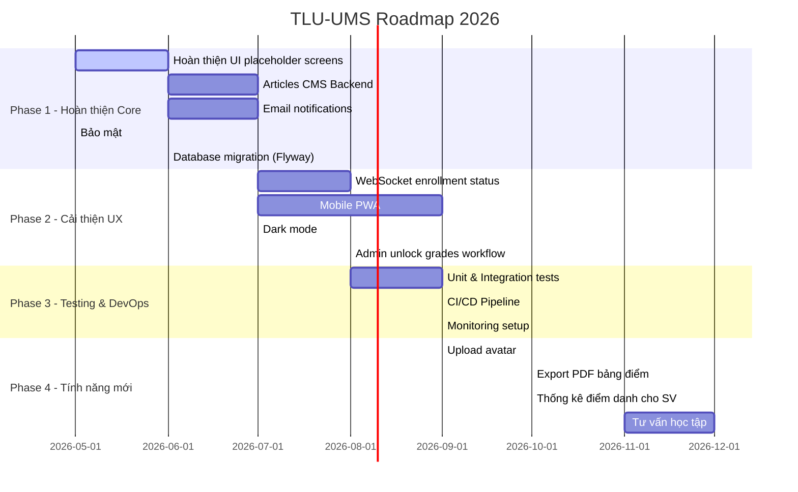

# 💡 Đánh Giá & Đề Xuất Cải Tiến — ThangLong University Web

> **Mã tài liệu:** DOC-10 | **Phiên bản:** 1.0 | **Ngày tạo:** 28/05/2026

---

## Mục Lục
- [1. Điểm Mạnh Hiện Tại](#1-điểm-mạnh-hiện-tại)
- [2. Hạn Chế & Điểm Cần Cải Thiện](#2-hạn-chế--điểm-cần-cải-thiện)
- [3. Rủi Ro Kỹ Thuật](#3-rủi-ro-kỹ-thuật)
- [4. Rủi Ro Nghiệp Vụ](#4-rủi-ro-nghiệp-vụ)
- [5. Đề Xuất Cải Tiến Chức Năng](#5-đề-xuất-cải-tiến-chức-năng)
- [6. Đề Xuất Cải Tiến Kỹ Thuật](#6-đề-xuất-cải-tiến-kỹ-thuật)
- [7. Roadmap Phát Triển Tiếp Theo](#7-roadmap-phát-triển-tiếp-theo)

---

## 1. Điểm Mạnh Hiện Tại

### 1.1 Kiến Trúc & Công Nghệ

| Điểm mạnh | Chi tiết |
|-----------|---------|
| ✅ **Kiến trúc phân lớp rõ ràng** | Controller → Service → Repository → Entity, dễ maintain |
| ✅ **Async enrollment qua Kafka** | Tránh bottleneck khi nhiều SV đăng ký cùng lúc, production-ready |
| ✅ **JWT + Redis token management** | Bảo mật cao, hỗ trợ logout thực sự (blacklist) |
| ✅ **Real-time chat qua WebSocket** | Trải nghiệm tốt, không cần polling |
| ✅ **Tích hợp VNPay** | Thanh toán học phí trực tuyến, production-ready với HMAC verification |
| ✅ **Chatbot AI (RAG)** | Chatbot thông minh dựa trên knowledge base, không phải hard-coded FAQ |
| ✅ **TypeScript strict** | Giảm runtime errors, type-safe API contracts |
| ✅ **shadcn/ui + Radix UI** | Components accessible, dễ tùy chỉnh |
| ✅ **Docker Compose** | Dễ setup môi trường dev |
| ✅ **Swagger/OpenAPI** | API documentation tự động |

### 1.2 Tính Năng Nghiệp Vụ

| Điểm mạnh | Chi tiết |
|-----------|---------|
| ✅ **Quản lý toàn vòng đời học kỳ** | Từ tạo → đăng ký → điểm danh → nhập điểm → thi lại → kết thúc |
| ✅ **Vòng đời đăng ký thi lại hoàn chỉnh** | RETAKE và IMPROVE, quản lý phí thi lại |
| ✅ **GPA/CPA tự động** | Hệ thống tính và cập nhật academic_results tự động |
| ✅ **Phân quyền 3 cấp** | ADMIN, TEACHER, STUDENT với phân biệt rõ ràng |
| ✅ **Xuất báo cáo Excel** | Dữ liệu đăng ký, lịch thi, thi lại |
| ✅ **Audit logging** | Ghi nhận mọi thao tác quan trọng |
| ✅ **Multi-schedule lớp học phần** | Lớp có thể học nhiều buổi/tuần |
| ✅ **Marketing website** | Landing page đẹp, responsive |

---

## 2. Hạn Chế & Điểm Cần Cải Thiện

### 2.1 Backend

| # | Vấn đề | Tầm quan trọng | Chi tiết |
|---|--------|---------------|---------|
| B-01 | **Articles API chưa có** | 🔴 Cao | `articles.ts` chỉ là stub, trả về mock data trống. Chưa có backend CMS |
| B-02 | **Thiếu unit tests** | 🔴 Cao | Chưa xác định được test coverage trong `backend/src/test/` |
| B-03 | **TeacherGradeController vs TeacherController trùng chức năng nhập điểm** | 🟡 Trung bình | Có 2 endpoint nhập điểm: `/api/teacher/grades/{enrollmentId}` và `/api/teacher/enrollments/{enrollmentId}/grade` |
| B-04 | **GlobalExceptionHandler chưa đồng nhất** | 🟡 Trung bình | Một số controller trả String error thay vì structured error response |
| B-05 | **Không có rate limiting** | 🟡 Trung bình | API có thể bị abuse |
| B-06 | **Chưa có email notifications** | 🟡 Trung bình | Thông báo chỉ qua hệ thống, không có email |
| B-07 | **Kafka consumer error handling** | 🟡 Trung bình | Cần DLQ (Dead Letter Queue) cho messages thất bại |

### 2.2 Frontend

| # | Vấn đề | Tầm quan trọng | Chi tiết |
|---|--------|---------------|---------|
| F-01 | **Một số route placeholder** | 🔴 Cao | `/admin/class-sections`, `/student/grades`, `/admin/exam-registrations` có thể chưa hoàn thiện (file size nhỏ) |
| F-02 | **Polling thay vì WebSocket cho enrollment** | 🟡 Trung bình | UX kém khi phải chờ polling |
| F-03 | **Không có dark mode** | 🟢 Thấp | Chưa có theme toggle |
| F-04 | **Không có skeleton loaders** đồng nhất | 🟡 Trung bình | Một số màn hình không có loading state tốt |
| F-05 | **Article data là mock** | 🔴 Cao | Dùng mock data cho bài viết |

### 2.3 Database

| # | Vấn đề | Tầm quan trọng | Chi tiết |
|---|--------|---------------|---------|
| D-01 | **Mật khẩu mặc định trong seed data** | 🔴 Cao | `schema.sql` có TODO: đổi default password khi deploy |
| D-02 | **Thiếu migration tool** | 🟡 Trung bình | Chỉ có `schema.sql`, không có Flyway/Liquibase |
| D-03 | **Một số quan hệ denormalization** | 🟢 Thấp | `enrollments` có `mid_term_score`, `final_score`, `total_score` trùng với `grades` |

---

## 3. Rủi Ro Kỹ Thuật

| Rủi ro | Mức độ | Xác suất | Phương án giảm thiểu |
|--------|--------|----------|----------------------|
| Kafka consumer đơn điểm lỗi (single consumer) | 🔴 Cao | Trung bình | Scale consumer group, thêm DLQ |
| PostgreSQL không có replica | 🔴 Cao | Thấp | Cấu hình read replica hoặc Supabase |
| JWT secret key bị lộ | 🔴 Cao | Thấp | Quản lý secrets với Vault hoặc env variables chặt chẽ |
| Cloudinary rate limit | 🟡 Trung bình | Thấp | Thêm file size validation, CDN caching |
| Groq API key bị lộ hoặc hết quota | 🟡 Trung bình | Trung bình | Rotate keys, monitor usage |
| VNPay txn_ref collision | 🟢 Thấp | Rất thấp | Dùng UUID làm txn_ref |

---

## 4. Rủi Ro Nghiệp Vụ

| Rủi ro | Mức độ | Phương án giảm thiểu |
|--------|--------|----------------------|
| SV đăng ký sai lớp/môn | 🟡 Trung bình | Thêm confirmation step, cho phép hủy trong thời gian ngắn |
| GV nhập điểm sai và không thể sửa sau khi khóa | 🔴 Cao | Thêm quy trình Admin unlock điểm với approval |
| Thanh toán bị lỗi giữa chừng, tiền bị trừ nhưng is_completed=false | 🔴 Cao | VNPay reconciliation job, retry mechanism |
| SV thi lại nhưng không được đăng ký do quên | 🟡 Trung bình | Email/push notification nhắc nhở trước deadline |
| Admin đóng đăng ký sớm khi SV chưa kịp đăng ký | 🟡 Trung bình | Dashboard cảnh báo số SV chưa đăng ký |

---

## 5. Đề Xuất Cải Tiến Chức Năng

### Priority 1 — Quan trọng, cần làm ngay

| # | Đề xuất | Lý do | Mô tả kỹ thuật |
|---|---------|-------|----------------|
| 1 | **Xây dựng CMS/Article backend** | Articles API đang là stub | Thêm `articles`, `categories`, `tags` tables; CRUD API `/api/admin/articles`; Tích hợp Cloudinary cho ảnh bài viết |
| 2 | **Admin unlock điểm workflow** | GV không thể sửa sau khi khóa | Thêm endpoint Admin unlock grades với audit log ghi nhận lý do |
| 3 | **Email notifications** | Quan trọng cho nhắc nhở deadline | Tích hợp JavaMail/SendGrid, gửi khi mở/đóng đăng ký, lịch thi, kết quả điểm |
| 4 | **Đổi default passwords** | Rủi ro bảo mật | Enforce password change lần đầu đăng nhập |
| 5 | **Database migration tool** | Quản lý schema thay đổi | Tích hợp Flyway hoặc Liquibase |

### Priority 2 — Cải thiện UX

| # | Đề xuất | Lý do |
|---|---------|-------|
| 6 | **WebSocket cho enrollment status** | Thay polling, UX tốt hơn |
| 7 | **Mobile PWA** | Sinh viên dùng điện thoại nhiều |
| 8 | **Dark mode** | Trải nghiệm tốt hơn khi dùng ban đêm |
| 9 | **Export PDF** cho bảng điểm | SV cần bảng điểm dạng PDF |
| 10 | **Notification push via browser** | Web push notifications |

### Priority 3 — Tính năng mới

| # | Đề xuất | Lý do |
|---|---------|-------|
| 11 | **Upload avatar** cho sinh viên/GV | Cá nhân hóa hồ sơ |
| 12 | **Lịch học dạng Google Calendar** | Sync TKB sang Google Calendar |
| 13 | **Thống kê điểm danh** cho sinh viên | SV biết bao nhiêu buổi vắng |
| 14 | **Module tư vấn học tập** | GV có thể comment cho SV về học lực |
| 15 | **API tìm kiếm toàn text** | Tìm kiếm SV, GV, môn học |

---

## 6. Đề Xuất Cải Tiến Kỹ Thuật

| # | Đề xuất | Lý do |
|---|---------|-------|
| T-01 | Thêm Rate Limiting (Spring RateLimiter hoặc Bucket4j) | Bảo vệ API khỏi abuse |
| T-02 | Triển khai Kafka DLQ cho enrollment failures | Không mất tin nhắn khi consumer lỗi |
| T-03 | Chuẩn hóa error response format toàn bộ API | Consistency cho frontend xử lý lỗi |
| T-04 | Thêm API response compression (GZIP) | Giảm bandwidth |
| T-05 | Viết unit tests cho Services (JUnit 5 + Mockito) | Đảm bảo code quality |
| T-06 | Integration tests cho critical flows | Enrollment, Payment |
| T-07 | Setup CI/CD pipeline (GitHub Actions) | Tự động build, test, deploy |
| T-08 | Monitoring (Prometheus + Grafana) | Theo dõi hiệu năng production |
| T-09 | Distributed tracing (OpenTelemetry) | Debug distributed system |
| T-10 | Database indexing review | Optimize slow queries |

---

## 7. Roadmap Phát Triển Tiếp Theo

### Ưu tiên Phase 1 (Tháng 5-6/2026):

| Việc cần làm | Effort | Impact |
|-------------|--------|--------|
| Hoàn thiện placeholder screens | S | 🔴 Cao |
| Articles CMS | M | 🔴 Cao |
| Email notifications | M | 🔴 Cao |
| Đổi default passwords | XS | 🔴 Cao |
| Flyway migration | S | 🟡 Trung bình |

> **Ghi chú Effort:** XS = < 1 ngày, S = 1-3 ngày, M = 1-2 tuần, L = > 2 tuần

---

## 8. Tóm Tắt Đánh Giá Tổng Thể

| Tiêu chí | Đánh giá | Điểm (1-5) |
|----------|---------|-----------|
| **Kiến trúc kỹ thuật** | Excellent — phân lớp tốt, production-ready | ⭐⭐⭐⭐⭐ |
| **Độ bao phủ chức năng** | Good — hầu hết core features đã có | ⭐⭐⭐⭐ |
| **Bảo mật** | Good — JWT, RBAC, audit log | ⭐⭐⭐⭐ |
| **UX/UI** | Good — đẹp, responsive | ⭐⭐⭐⭐ |
| **Kiểm thử** | Fair — thiếu automated tests | ⭐⭐⭐ |
| **Tài liệu** | Good — có AGENTS-BACKEND.md, Swagger | ⭐⭐⭐⭐ |
| **Khả năng scale** | Good — Kafka, Redis, Docker | ⭐⭐⭐⭐ |
| **Hoàn thiện** | Fair — một số tính năng còn stub/placeholder | ⭐⭐⭐ |

**Kết luận:** Đây là một hệ thống có kiến trúc tốt, tích hợp nhiều công nghệ hiện đại (Kafka, Redis, WebSocket, AI chatbot, VNPay). Các core features đã được triển khai đầy đủ. Cần hoàn thiện một số UI screens còn placeholder và xây dựng module Article/CMS để hệ thống hoàn chỉnh hơn. Ưu tiên cao nhất là viết automated tests và thiết lập CI/CD trước khi deploy production.
